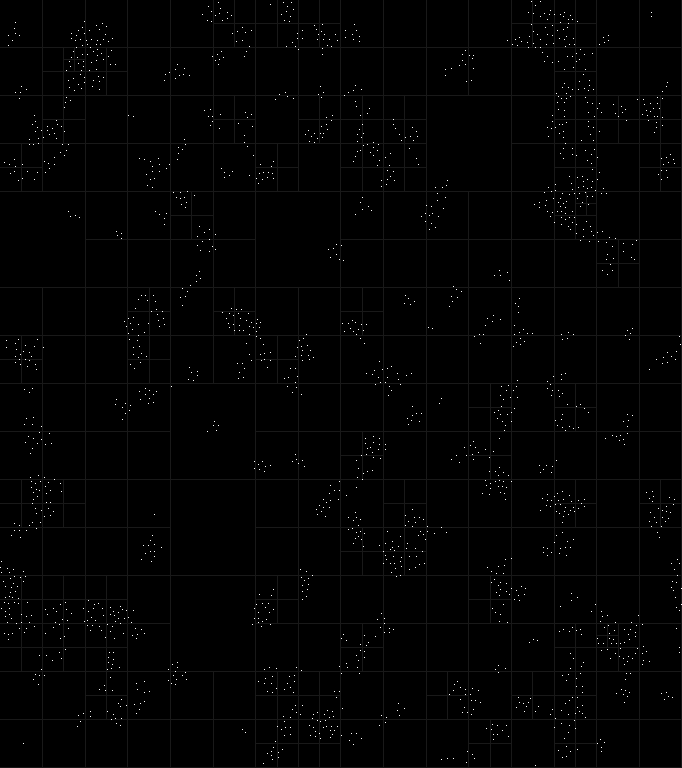

# microboids
*A work in progress*

An implementation of Chris Reynolds flocking behaviour simulator written in C. The objective of this rendition is to simulate as many small Boids as possible.
## Requirements
* gcc
* make
* ligbglfw3
## Instructions 
* Run 'make'
* Run ./boids
## Screenshot

